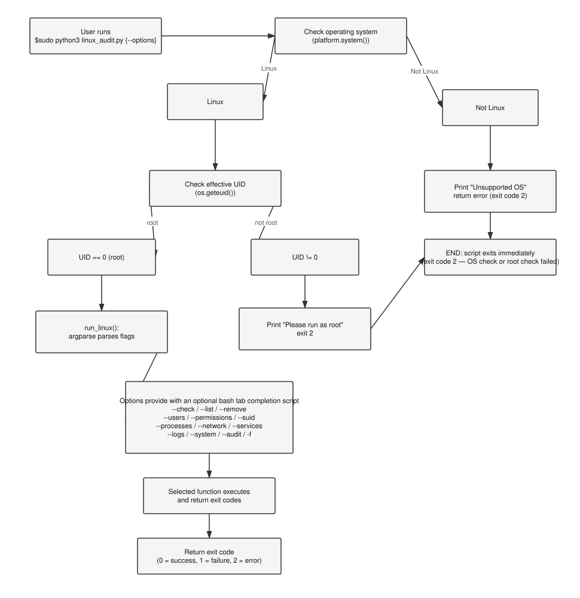

# Linux_sys_admin_tool

Linux system administration tool for geeks who are into linux and want top notch security. By running this script you will be able to scan your linux system security.

## This is a zero dependency hackathon and all the zero dep proofs are there in the deps-proof.txt file in this github repo — you can check it out there. This is the first and most vital proof of zero dep.

### I have also made a video in which I am using the script in an isolated python environment which is clean. That is the second proof.

### You can see the write-up of this repo here-https://zero-dependency-hackathon-write-up.github.io/

Nowadays we have seen many attacks on linux servers. LPE (Linux privilege escalation) has now become a common friend of ours. After AI, attacks and threats to linux servers are rising. To tackle this we have our great heroes, system administrators, which protect our servers and systems.

This script is for system admins and also for tech enthusiasts who want their system secure and top notch.

Usually admins have to run 1000s of commands to check linux servers, this creates a load on them and they might have some other work to do. The solution is our Linux_sys_admin script which dynamically searches for any security bugs and reports it to the user. This is an all in one tool for security. Admins now don't need to run 1000 different commands or make a bash script for automation, this script makes admins' lives easier.

## I have chosen TRACK A for this hackathon. This is a CLI tool for security.

**Note - It is strictly for linux admins only. We might add functions for cross platform in future updates**

## Requirements

- Linux (tested on Parrot and Pop-os)
- Python 3.10+ (`verify_stdlib.py` relies on `sys.stdlib_module_names`, added in Python 3.10)
- Root privileges — the script refuses to run without them
- Not compatible with Windows or macOS. Windows users can run it under WSL2, since that's a real Linux kernel.

## Usage

Clone this repo:
```bash
git clone https://github.com/Bhavishyaa12/Linux_sys_admin_tool.git
cd Linux_sys_admin_tool
```
If you want to check all of the imports of the main script.py then you can run 
```bash
make test
```
This test checks for all of the imports in the python file using AST (Abstract syntax tree) and reports if any third-party libraries is found.

Run `make help` for full help with the options.

Options example:
```bash
make system    # system info
make logs      # authentication logs info
```

These were a few examples. There are more options in the Makefile, you can run them by `make <option>`.

**Note - The Makefile commands are intentionally written with sudo preceding them to ensure root security.**

# Flowchart 

<p align="center">
  
</p>

## Options

The options in the script provided are:

1. **`-f` or `--file_integrity`** — This option checks if the file metadata database exists (if not, it is created as `hashes.json`). You can also add files by appending arguments to the option, for example `-f /etc/vim/vimrc` also creates a hash database entry for `/etc/vim/vimrc` (by default the hash list and file metadata contains two files — `/etc/passwd` and `/etc/group` — which are extremely important for a linux system admin). The `hashes.json` file contains the file metadata such as the file hash (SHA-256), size of the file (in bytes), UID, GID, and modification time (mtime) of the files.
   It works by calling the `calculate_hash` function, which takes a filename as an argument and returns the hash of the file by reading it in binary mode (`"b"`) and iterating over it in 4096-byte chunks to produce a hash using the standard library `hashlib`. Next, `check_hashes` safely exits with an error code if the hash database does not exist; if it does exist, it checks the current hashes of the files and matches them against the database. This function also checks for UID, GID, and mtime changes and reports them.

2. **`--check`** — As the name suggests, it checks if the current files have been changed or modified by anyone and reports an error (exit code > 0) to the user. If the file hashes have not changed, it shows a pass signal.

3. **`--list`** — Another convenient option for checking which files are in the database (`hashes.json`), so the user can see a list of files being tracked at the current moment.

4. **`--remove`** — This option helps the user untrack (remove a file from the database).

5. **`--users`** — This option is critical, as it checks if there is a user with UID 0 other than root. This is the basis of LPE — an attacker may compromise an account and gain root access (if a user has UID 0, the system might be compromised — it's an alert for the sys admin). This option is like a warning bell for sys admins.

6. **`--permissions`** — Shows which files have world-writable permissions (777), which can be edited and executed by others.

7. **`--suid`** — Shows whether the SUID and SGID special binary bits are enabled on any files. SUID and SGID are very critical for an executable, as they carry the risk of running as root (effective user and group ID == 0). An attacker can modify a buggy program with these bits set and gain root access — checking for these permissions is essential.

8. **`--processes`** — Shows the currently running processes on the system, useful for checking load on CPU, memory (RAM), and swap. It works by reading `/proc`, which is exposed by the linux kernel via the virtual filesystem.

9. **`--network`** — Shows the listening ports on the device (TCP/UDP) and lists their port numbers to ensure port security remains intact. The user can then use a firewall to block incoming connections on any open port to prevent an attack.

10. **`--services`** — Shows the services currently running on the system using the `subprocess` module. `systemctl` is used to get the currently active services.

11. **`--logs`** — First checks a list of authentication log file paths and loops over them to see if any are present (using `os.path.isfile()`). If a file is found, it shows the authentication logs. Useful for a quick check of users' failed password attempts.

12. **`--system`** — Shows system information such as load average (CPU), total and available memory, disk usage, architecture (e.g. amd64/x64), and more. It works by reading `/proc`, which is exposed by the linux kernel via its virtual filesystem, using the `read_proc_file()` method in Python.

13. **`--audit`** — This is the go-to option for sys admins. It's a global option that runs every other option at once and returns the output as a full audit report, showing everything from file integrity checks to system information.

## Tab completion (optional)

I have also added a bash tab completion script named `bash_tab_complete.bash`, which you can use as a tab completion helper by sourcing it (`source` or `.`) in your current shell. This script tries to complete the options listed above just by pressing Tab — for example, `$sudo python3 Linux_sys_admin.py --<TAB>` shows the 13 options above on standard output (FD == 1), from which you can easily pick an option to autocomplete by pressing Tab again — e.g. `--s<TAB>` autocompletes to `--system`.

**Note — This is completely optional and has no connection to the main python script.**

## Zero-dependency verification

We also have `verify_stdlib.py` in this repo, which verifies whether a given Python script (passed as `sys.argv[1]`) only uses standard library imports. It works by asking Python's own brain (its AST — Abstract Syntax Tree) to tell us whether the script is eligible for our zero-dependency hackathon submission. Since this checker script itself only uses standard library modules (`ast`, `sys`), it ensures there are no tricks involved, such as a hidden import or anything else.
